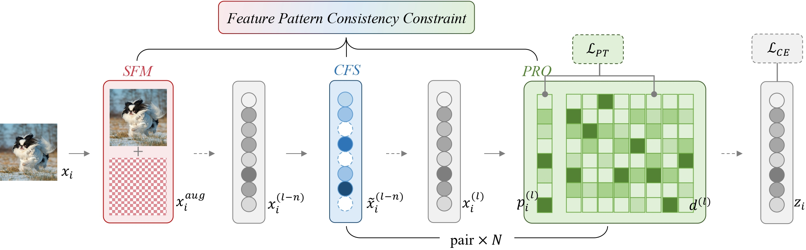

# Improving Adversarial Robustness via <font color=#9ACA7C>F</font>eature <font color=#9ACA7C>P</font>attern <font color=#9ACA7C>C</font>onsistency <font color=#9ACA7C>C</font>onstraint



### Requirements

+ Python version: 3.9
+ PyTorch version: 2.0.1
+ GPU: NVIDIA RTX A6000 / NVIDIA A40

### Quick Start
+ Training a Baseline Model
```bash
python engines/train.py \
  --model_name 'wrn2810' \
  --data_name 'cifar10' \
  --num_classes 10 \
  --num_epochs 200 \
  --model_dir ${model_dir} \
  --data_train_dir ${data_train_dir} \
  --data_test_dir ${data_test_dir} \
  --log_dir ${log_dir}
```

+ Training a Model with FPCC (\lambda and \gamma can be configured in code)
```bash
python engines/train_fpcc.py \
  --model_name 'wrn2810_fpcc' \
  --data_name 'cifar10' \
  --num_classes 10 \
  --num_epochs 200 \
  --data_train_dir ${data_train_dir} \
  --data_test_dir ${data_test_dir} \
  --save_dir ${save_dir} \
  --log_dir ${log_dir}
```

+ Testing Standard Accuracy on Clean Data
```bash
python engines/test.py \
  --model_name ${model_name} \
  --data_name ${data_name} \
  --num_classes ${num_classes} \
  --model_path ${model_path} \
  --data_dir ${data_dir}
```

+ Testing Robust Accuracy Against Various Attacks
```bash
  python engines/attack.py \
    --model_name ${model_name} \
    --data_name ${data_name} \
    --num_classes ${num_classes} \
    --attack_name ${attack_name} \
    --model_path ${model_path} \
    --data_dir ${data_dir} \
    --save_dir ${save_dir} \
    --is_save
```